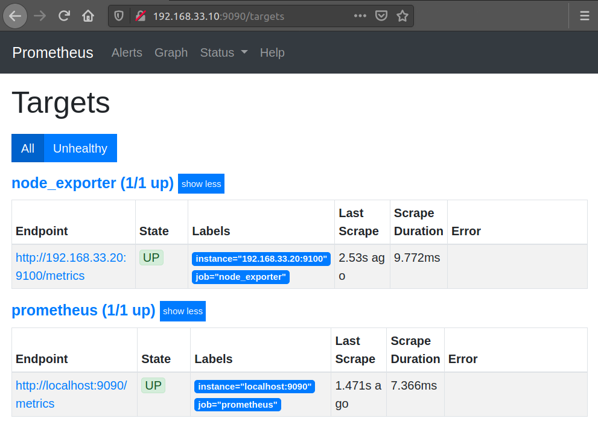
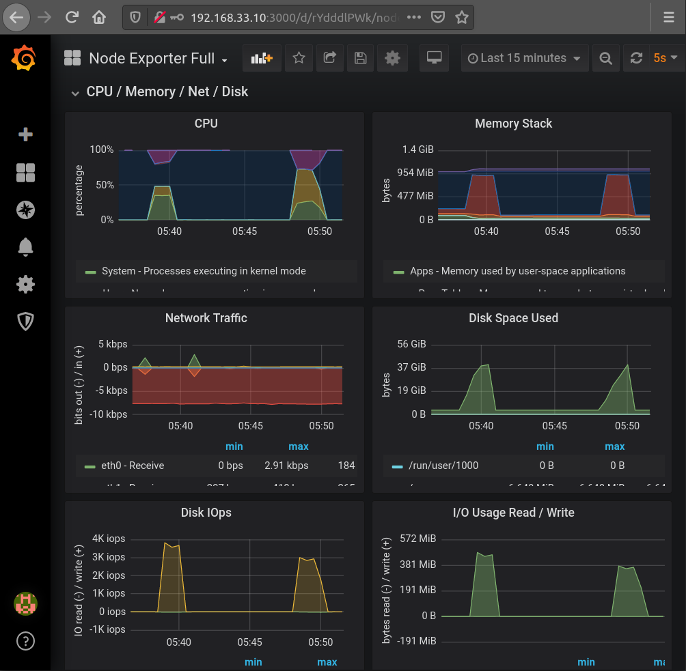
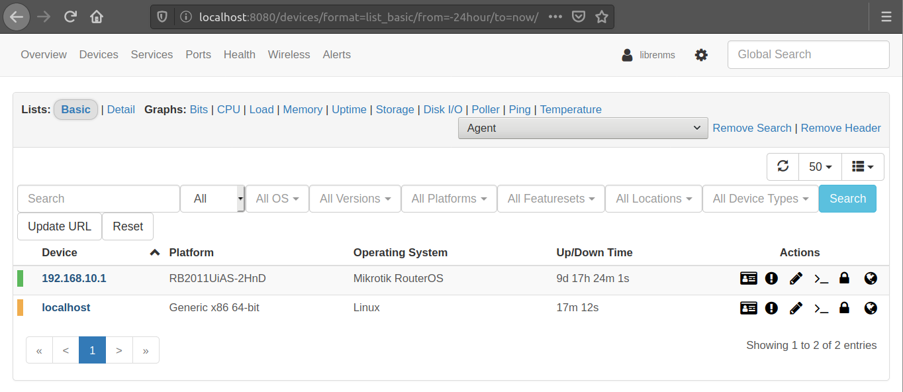
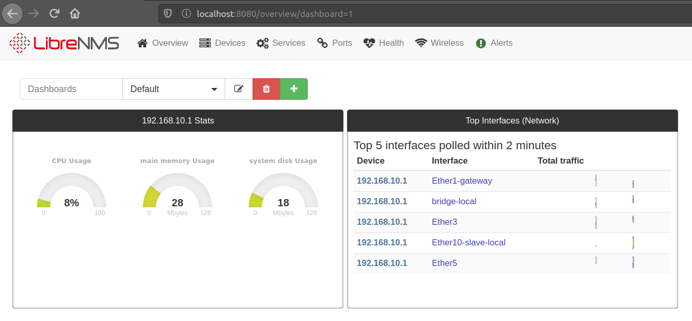

### Настройка мониторинга

Разворачиваем две машины:
- prometheus - сервер с ПО prometheus + grafana - 192.168.33.10
- server - сервер который будем мониторить - 192.168.33.20

Установка Prometheus:  
скачиваем, создаем пользователя, создаем сервис
```
yum -y update && yum install -y wget
cd /tmp
wget https://github.com/prometheus/prometheus/releases/download/v2.17.2/prometheus-2.17.2.linux-amd64.tar.gz
tar xf prometheus-2.17.2.linux-amd64.tar.gz

mkdir /etc/prometheus
mkdir /var/lib/prometheus

mv prometheus-2.17.2.linux-amd64/* /var/lib/prometheus/
mv /var/lib/prometheus/prometheus.yml /etc/prometheus/
ln -s /var/lib/prometheus/prometheus /usr/local/bin/prometheus

useradd --no-create-home -s /bin/false prometheus
chown prometheus:prometheus /etc/prometheus
chown -R prometheus:prometheus /var/lib/prometheus

cat > /etc/systemd/system/prometheus.service << \EOF
[Unit]
Description=Prometheus
Wants=network-online.target
After=network-online.target

[Service]
User=prometheus
Group=prometheus
Type=simple
ExecStart=/usr/local/bin/prometheus \
--config.file /etc/prometheus/prometheus.yml \
--storage.tsdb.path /var/lib/prometheus/ \
--web.console.templates=/var/lib/prometheus/consoles \
--web.console.libraries=/var/lib/prometheus/console_libraries

[Install]
WantedBy=multi-user.target
EOF

systemctl enable --now prometheus.service
```

Установка Node_Exporter на server:  
скачиваем, создаем пользователя, создаем сервис
```
yum -y update && yum install -y wget
cd /tmp
wget https://github.com/prometheus/node_exporter/releases/download/v0.18.1/node_exporter-0.18.1.linux-amd64.tar.gz
tar xf node_exporter-0.18.1.linux-amd64.tar.gz
mkdir -p /var/lib/prometheus/node_exporter
mv node_exporter-0.18.1.linux-amd64/* /var/lib/prometheus/node_exporter/

useradd --no-create-home -s /bin/false prometheus
chown -R prometheus:prometheus /var/lib/prometheus/node_exporter/

cat > /etc/systemd/system/node_exporter.service << \EOF
[Unit]
Description=Node Exporter
Wants=network-online.target
After=network-online.target

[Service]
User=prometheus
ExecStart=/var/lib/prometheus/node_exporter/node_exporter

[Install]
WantedBy=multi-user.target
EOF

systemctl enable --now node_exporter.service
```

Настройка Prometheus для работы с Node_Exporter:  
на сервере prometheus в файле /etc/prometheus/prometheus.yml указываем ip сервера server
```
echo -e "\n  - job_name: 'node_exporter'
    static_configs:
    - targets: ['192.168.33.20:9100']" >> /etc/prometheus/prometheus.yml

systemctl restart prometheus.service
```
Проверяем



Установка и настройка Grafana:  
скачиваем, настраиваем веб-доступ, стартуем сервис
```
cd /tmp
wget https://dl.grafana.com/oss/release/grafana-6.7.3-1.x86_64.rpm
yum install grafana-6.7.3-1.x86_64.rpm

vi /etc/grafana/grafana.ini
protocol = http
http_port = 3000

systemctl enable --now grafana-server.service
```

В веб-интерфейсе 192.168.33.10:9000 Grafana:

Configuration - Data Sources - Add data source - Prometheus, указываем url http://192.168.33.10:9090

Dashboards - Manage - Import, импортируем дэшборд Node Exporter Full - https://grafana.com/grafana/dashboards/1860

В поле Select a Ptometheus data source выбираем Prometheus

После настройки дэшборда получаем удобное представление метрик node_exporter



Установка LibreNMS:  
возьмем собранную систему в формате ova и импортируем в virtualbox - https://github.com/librenms/packer-builds/releases/latest

Настроим на опрос сетевого оборудования по snmp, выведем загрузку ресурсов




