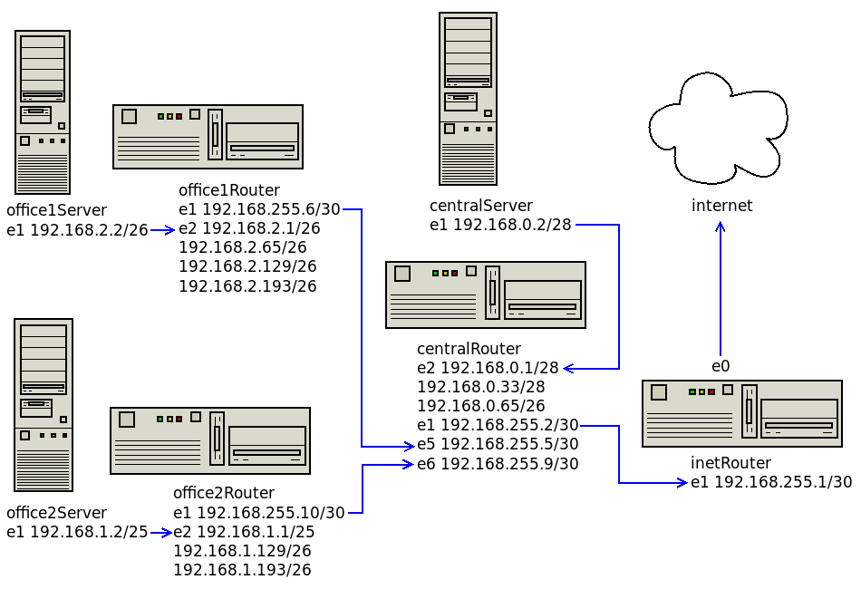

### Разворачиваем сетевую лабораторию

Дано:  
https://github.com/erlong15/otus-linux/tree/network  
(ветка network)

Vagrantfile с начальным построением сети
- inetRouter
- centralRouter
- centralServer

Теоретическая и практическая часть
- Найти свободные подсети
- Посчитать сколько узлов в каждой подсети, включая свободные
- Указать broadcast адрес для каждой подсети
- Проверить нет ли ошибок при разбиении
- Соединить офисы в сеть согласно схеме и настроить роутинг
- Все сервера и роутеры должны ходить в инет черз inetRouter
- Все сервера должны видеть друг друга
- У всех новых серверов отключить дефолт на нат (eth0), который вагрант поднимает для связи



Office1

сеть | описание | кол-во узлов | broadcast
---|---|---|---
192.168.2.0/26 | dev | 62 | .63
192.168.2.64/26 | test servers | 62 | .127
192.168.2.128/26 | managers | 62 | .191
192.168.2.192/26 | hardware | 62 | .255
192.168.255.4/30 | ofc1-center | 2 |

Office2

сеть | описание | кол-во узлов | broadcast
---|---|---|---
192.168.1.0/25 | dev | 126 | .127
192.168.1.128/26 | test servers | 62 | .191
192.168.1.192/26 | hardware | 62 | .255
192.168.255.8/30 | ofc2-center | 2 |

CentralRouter

сеть | описание | кол-во узлов | broadcast
---|---|---|---
192.168.0.0/28 | directors | 14 | .15
192.168.0.16/28 | свободно | 14 | .31
192.168.0.32/28 | office hardware | 14 | .47
192.168.0.48/28 | свободно | 14 | .63
192.168.0.64/26 | wifi | 62 | .127
192.168.0.128/25 | свободно | 126 | .255
192.168.255.4/30 | ofc1-center | 2 |
192.168.255.8/30 | ofc2-center | 2 |

Отключаем дефолт на eth0 и задаем шлюз на eth1
```
echo "DEFROUTE=no" >> /etc/sysconfig/network-scripts/ifcfg-eth0
echo "GATEWAY=192.168.255.1" >> /etc/sysconfig/network-scripts/ifcfg-eth1
```
Прописываем маршруты и включаем роутинг (до перезагрузки)
```
ip route add 192.168.0.0/24 via 192.168.255.2 dev eth1
sysctl net.ipv4.conf.all.forwarding=1
```
Для сохранения настроек
```
echo "192.168.0.0/24 via 192.168.255.2 dev eth1" > /etc/sysconfig/network-scripts/route-eth1
echo "net.ipv4.conf.all.forwarding = 1" > /etc/sysctl.d/990-sysctl.conf
```

Проверка

```
centralServer

ping 192.168.2.2 -c 1
ping 192.168.1.2 -c 1
ping 8.8.8.8 -c 1

office1Server

ping 192.168.1.2 -c 1
ping 192.168.0.2 -c 1
ping 8.8.8.8 -c 1

office2Server

ping 192.168.2.2 -c 1
ping 192.168.0.2 -c 1
ping 8.8.8.8 -c 1

office1Router

ping 8.8.8.8 -c 1 -I eth1
tracepath -n 8.8.8.8

office2Router

ping 8.8.8.8 -c 1 -I eth1
tracepath -n 8.8.8.8

inetRouter

ifdown eth1 -> отключаем интернет
```
