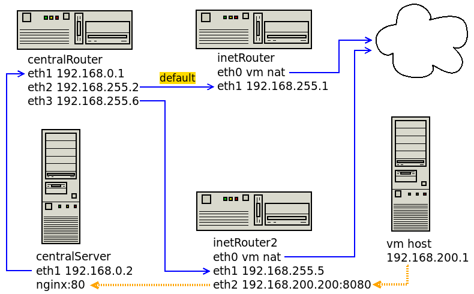

### Сценарии iptables

1) реализовать knocking port - centralRouter может попасть на ssh inetrRouter через knock скрипт  
2) добавить inetRouter2, который виден (маршрутизируется - host-only тип сети для виртуалки) с хоста или форвардится порт через локалхост  
3) запустить nginx на centralServer  
4) пробросить 80й порт на inetRouter2 8080  
5) дефолт в инет оставить через inetRouter  
6) реализовать проход на 80й порт без маскарадинга



Ставим ПО
```
epel-release
nginx
conntrack
nc
```
Для ssh используются заранее подготовленные ключи, которые загружаются на два сервера - применимо только для тестов

Настройки iptables на inetRouter для port knocking - ssh открывается после udp на 12345 23456 34567 и добавлены разрешения для вагранта
```
iptables -F
iptables -X
iptables -Z

iptables -N STATE0
iptables -A STATE0 -p udp --dport 12345 -m recent --name KNOCK1 --set -j DROP
iptables -A STATE0 -j DROP

iptables -N STATE1
iptables -A STATE1 -m recent --name KNOCK1 --remove
iptables -A STATE1 -p udp --dport 23456 -m recent --name KNOCK2 --set -j DROP
iptables -A STATE1 -j STATE0

iptables -N STATE2
iptables -A STATE2 -m recent --name KNOCK2 --remove
iptables -A STATE2 -p udp --dport 34567 -m recent --name KNOCK3 --set -j DROP
iptables -A STATE2 -j STATE0

iptables -N STATE3
iptables -A STATE3 -m recent --name KNOCK3 --remove
iptables -A STATE3 -p tcp --dport 22 -j ACCEPT
iptables -A STATE3 -j STATE0

iptables -A INPUT -m state --state ESTABLISHED,RELATED -j ACCEPT
iptables -A INPUT -s 127.0.0.0/8 -j ACCEPT
iptables -A INPUT -p tcp -s ! 192.168.255.0/24 --dport 22 -j ACCEPT
iptables -A INPUT -i eth0 -j ACCEPT
iptables -A INPUT -p icmp -j ACCEPT

iptables -A INPUT -m recent --name KNOCK3 --rcheck -j STATE3
iptables -A INPUT -m recent --name KNOCK2 --rcheck -j STATE2
iptables -A INPUT -m recent --name KNOCK1 --rcheck -j STATE1
iptables -A INPUT -j STATE0
```
Подключение делается скриптом knocks.sh
```
[vagrant@centralRouter ~]$ ./knocks.sh 12345 23456 34567
...
[vagrant@inetRouter ~]$
```
Настройка проброса портов inetRouter2:8080 -> centralServer:80

Фаерволл на centralServer - разрешаем входящий http
```
systemctl enable --now firewalld.service
firewall-cmd --zone=internal --add-interface=eth1
firewall-cmd --add-service=http --zone=internal
firewall-cmd --remove-service=dhcpv6-client --zone=internal
firewall-cmd --remove-service=samba-client --zone=internal
firewall-cmd --runtime-to-permanent
firewall-cmd --reload
```
Фаерволл на inetRouter2

eth1 в зону internal, eth2 в зону external, отключаем masquerade
```
firewall-cmd --state
systemctl enable --now firewalld.service

firewall-cmd --get-zones
firewall-cmd --info-service=http

firewall-cmd --zone=internal --add-interface=eth1
firewall-cmd --zone=external --add-interface=eth2

firewall-cmd --zone=internal --list-all
firewall-cmd --zone=external --list-all

firewall-cmd --remove-masquerade --zone=external
```
Варианты настройки

Есть маршрут на centralRouter "192.168.200.0/24 via 192.168.255.5 dev eth3" - сохраняется адрес источника
```
firewall-cmd --add-forward-port=port=8080:proto=tcp:toaddr=192.168.0.2:toport=80 --zone=external

[root@centralServer ~]# conntrack -E -p tcp
    [NEW] tcp      6 120 SYN_SENT src=192.168.200.1 dst=192.168.0.2 sport=40514 dport=80 [UNREPLIED] src=192.168.0.2 dst=192.168.200.1 sport=80 dport=40514
 [UPDATE] tcp      6 60 SYN_RECV src=192.168.200.1 dst=192.168.0.2 sport=40514 dport=80 src=192.168.0.2 dst=192.168.200.1 sport=80 dport=40514
 [UPDATE] tcp      6 432000 ESTABLISHED src=192.168.200.1 dst=192.168.0.2 sport=40514 dport=80 src=192.168.0.2 dst=192.168.200.1 sport=80 dport=40514 [ASSURED]
```
Есть маршрут на centralRouter "192.168.200.200 via 192.168.255.5 dev eth3" - адрес источника меняется на 192.168.200.200
```
firewall-cmd --add-forward-port=port=8080:proto=tcp:toaddr=192.168.0.2:toport=80 --zone=external
firewall-cmd --direct --add-rule ipv4 nat POSTROUTING 0 -p tcp -d 192.168.0.2 --dport 80 -j SNAT --to-source 192.168.200.200

[root@centralServer ~]# conntrack -E -p tcp
    [NEW] tcp      6 120 SYN_SENT src=192.168.200.200 dst=192.168.0.2 sport=40502 dport=80 [UNREPLIED] src=192.168.0.2 dst=192.168.200.200 sport=80 dport=40502
 [UPDATE] tcp      6 60 SYN_RECV src=192.168.200.200 dst=192.168.0.2 sport=40502 dport=80 src=192.168.0.2 dst=192.168.200.200 sport=80 dport=40502
 [UPDATE] tcp      6 432000 ESTABLISHED src=192.168.200.200 dst=192.168.0.2 sport=40502 dport=80 src=192.168.0.2 dst=192.168.200.200 sport=80 dport=40502 [ASSURED]
```
Нет маршрута на centralRouter до источника - адрес источника меняется на 192.168.255.5, который доступен по известному пути "192.168.255.4/30 dev eth3" - стенд настроен с этим вариантом
```
firewall-cmd --add-forward-port=port=8080:proto=tcp:toaddr=192.168.0.2:toport=80 --zone=external
firewall-cmd --direct --add-rule ipv4 nat POSTROUTING 0 -p tcp -d 192.168.0.2 --dport 80 -j SNAT --to-source 192.168.255.5

[root@centralServer ~]# conntrack -E -p tcp
    [NEW] tcp      6 120 SYN_SENT src=192.168.255.5 dst=192.168.0.2 sport=40474 dport=80 [UNREPLIED] src=192.168.0.2 dst=192.168.255.5 sport=80 dport=40474
 [UPDATE] tcp      6 60 SYN_RECV src=192.168.255.5 dst=192.168.0.2 sport=40474 dport=80 src=192.168.0.2 dst=192.168.255.5 sport=80 dport=40474
 [UPDATE] tcp      6 432000 ESTABLISHED src=192.168.255.5 dst=192.168.0.2 sport=40474 dport=80 src=192.168.0.2 dst=192.168.255.5 sport=80 dport=40474 [ASSURED]
```
Просмотр правил
```
firewall-cmd --direct --get-all-rules
iptables -L -v
```
Делаем постоянную конфигурацию
```
firewall-cmd --runtime-to-permanent
firewall-cmd --reload
```
Или то же самое через iptables, snat в 192.168.200.200 или 192.168.255.5
```
iptables -t nat -A PREROUTING -p tcp --dport 8080 -j DNAT --to-destination 192.168.0.2:80
iptables -t nat -A POSTROUTING -p tcp -d 192.168.0.2 --dport 80 -j SNAT --to-source 192.168.200.200
iptables -t nat -L -n

iptables -t nat -A PREROUTING -p tcp --dport 8080 -j DNAT --to-destination 192.168.0.2:80
iptables -t nat -A POSTROUTING -p tcp -d 192.168.0.2 --dport 80 -j SNAT --to-source 192.168.255.5
iptables -t nat -L -n

```
### Литература
- [Настройка Port Knocking](https://otus.ru/nest/post/267/)
- [Iptables REDIRECT vs. DNAT vs. TPROXY](http://gsoc-blog.ecklm.com/iptables-redirect-vs.-dnat-vs.-tproxy/)
