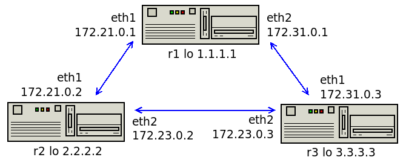

### OSPF

- Поднять три виртуалки
- Объединить их разными vlan
- Поднять OSPF между машинами на базе Quagga
- Изобразить ассиметричный роутинг
- Сделать один из линков "дорогим", но что бы при этом роутинг был симметричным



Асимметричный роутинг

Маршруты с равноценными линками
```
r2(config-if)# do sh ip ro o

O>* 1.1.1.1/32 [110/20] via 172.21.0.1, eth1, 00:32:32
O>* 3.3.3.3/32 [110/20] via 172.23.0.3, eth2, 00:00:00
O   172.21.0.0/24 [110/10] is directly connected, eth1, 00:32:33
O   172.23.0.0/24 [110/10] is directly connected, eth2, 00:00:01
O>* 172.31.0.0/24 [110/20] via 172.21.0.1, eth1, 00:00:01
  *                        via 172.23.0.3, eth2, 00:00:01
```
Делаем линк eth2 на r2 более дорогим
```
r2(config-if)# int eth2
r2(config-if)# ip ospf cost 100

r2(config-if)# do sh ip ro o

O>* 1.1.1.1/32 [110/20] via 172.21.0.1, eth1, 00:33:03
O>* 3.3.3.3/32 [110/20] via 172.21.0.1, eth1, 00:00:00
O   172.21.0.0/24 [110/10] is directly connected, eth1, 00:33:04
O   172.23.0.0/24 [110/30] via 172.21.0.1, eth1, 00:00:01
O>* 172.31.0.0/24 [110/20] via 172.21.0.1, eth1, 00:00:0
```
Запускаем пинг 3.3.3.3 на r2

С параметрами  
net.ipv4.conf.all.rp_filter=1  
net.ipv4.conf.all.log_martians=1  
в логе /var/log/messages будет сообщение  
IPv4: martian source 172.21.0.2 from 3.3.3.3, on dev eth2  
Пинг не проходит

Меняем net.ipv4.conf.all.rp_filter=2  
Пинг-запросы идут через r1, ответы - по линку r2r3
```
[root@r1 ~]# tcpdump -i 6 -p icmp
13:36:19.304292 IP 172.21.0.2 > 3.3.3.3: ICMP echo request, id 27040, seq 261, length 64
13:36:19.304331 IP 172.21.0.2 > 3.3.3.3: ICMP echo request, id 27040, seq 261, length 64

[root@r2 ~]# tcpdump -i 6 -p icmp
13:35:44.161787 IP r2 > 3.3.3.3: ICMP echo request, id 27040, seq 226, length 64
13:35:44.163166 IP 3.3.3.3 > r2: ICMP echo reply, id 27040, seq 226, length 64

[root@r3 ~]# tcpdump -i 6 -p icmp
13:42:55.232055 IP r3 > 2.2.2.2: ICMP echo request, id 4501, seq 1295, length 64
13:42:55.232406 IP 2.2.2.2 > r3: ICMP echo reply, id 4501, seq 1295, length 64
```
Делаем линк eth2 на r3 более дорогим и пинг становится симметричным через r1
```
r3(config-if)# int eth2
r3(config-if)# ip ospf cost 100

[root@r1 ~]# tcpdump -i 6 -p icmp
13:54:14.539352 IP 172.21.0.2 > 3.3.3.3: ICMP echo request, id 27040, seq 1333, length 64
13:54:14.539377 IP 172.21.0.2 > 3.3.3.3: ICMP echo request, id 27040, seq 1333, length 64
13:54:14.539731 IP 3.3.3.3 > 172.21.0.2: ICMP echo reply, id 27040, seq 1333, length 64
13:54:14.539743 IP 3.3.3.3 > 172.21.0.2: ICMP echo reply, id 27040, seq 1333, length 64
```
Оставим один дорогой линк e2 на r2 и добавим статический маршрут на r3  
Маршрут с меньшей АД более приоритетный  
Роутинг стал симметричным
```
r3(config-if)# int eth2
r3(config-if)# no ip ospf cost 100
r3(config-if)# ip route 2.2.2.2/32 172.31.0.1

r3(config)# do sh ip ro
S>* 2.2.2.2/32 [1/0] via 172.31.0.1, eth1
O   2.2.2.2/32 [110/20] via 172.23.0.2, eth2, 00:06:55

[vagrant@r2 ~]$ ping 3.3.3.3 -I 2.2.2.2
PING 3.3.3.3 (3.3.3.3) from 2.2.2.2 : 56(84) bytes of data.
64 bytes from 3.3.3.3: icmp_seq=1 ttl=63 time=1.10 ms

[root@r1 ~]# tcpdump -i 6 -p icmp
14:18:41.396069 IP 2.2.2.2 > 3.3.3.3: ICMP echo request, id 29492, seq 1, length 64
14:18:41.396930 IP 3.3.3.3 > 2.2.2.2: ICMP echo reply, id 29492, seq 1, length 64
```
### Литература
- [Dynamic Routing in Linux with Quagga](https://www.admin-magazine.com/Articles/Routing-with-Quagga)
- [Reverse Path Filtering (rp_filter) and Martians (log_martians)](https://www.theurbanpenguin.com/rp_filter-and-lpic-3-linux-security/)
