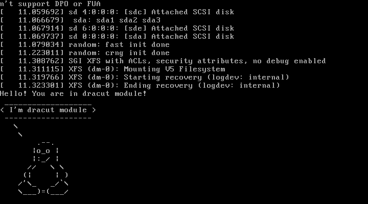

### Попасть в систему без пароля несколькими способами

##### Способ 1

При начале загрузки нажимаем e, откроется редактор параметров grub-а.

В строке linux16 нужно удалить "console=tty0 console=ttyS0,115200n8" (особенность vagrant), добавить "init=/bin/sh".

В консоли
```
mount -o remount,rw /
passwd
```
Для надежности
```
mount -o remount,ro /
```

Перезагрузка делается так (reboot не работает)
```
echo 1 > /proc/sys/kernel/sysrq
echo b > /proc/sysrq-trigger
```
В этом способе первым процессом в системе (pid=1) запускается sh, и он дает консоль с правами администратора.


##### Способ 2

В строке linux16 добавляем rd.break и нажимаем сtrl-x для загрузки.
Попадаем в emergency mode. Корневая ФС смонтирована в режиме Read-Only.
```
mount -o remount,rw /sysroot
chroot /sysroot
passwd root
exit
reboot
```
В этом способе загрузка ОС прерывается после загрузки initrd до монтирования корневой ФС. Корневая ФС видна как /sysroot. Для получения доступа нужно ее перемонтировать для записи и сделать временным корнем, откуда уже запускать смену пароля.

##### Способ 3

В строке linux16 добавляем init=/sysroot/bin/sh. Попадаем в emergency mode.
```
mount -o remount,rw /sysroot
chroot /sysroot
passwd root
exit
reboot
```

### Установить систему с LVM, переименовать VG

Смотрим текущее состояние системы
```
[root@lvm ~]# lsblk
NAME                    MAJ:MIN RM  SIZE RO TYPE MOUNTPOINT
sda                       8:0    0   40G  0 disk
├─sda1                    8:1    0    1M  0 part
├─sda2                    8:2    0    1G  0 part /boot
└─sda3                    8:3    0   39G  0 part
  ├─VolGroup00-LogVol00 253:0    0 37.5G  0 lvm  /
  └─VolGroup00-LogVol01 253:1    0  1.5G  0 lvm  [SWAP]
sdb                       8:16   0   10G  0 disk
sdc                       8:32   0    2G  0 disk
sdd                       8:48   0    1G  0 disk
sde                       8:64   0    1G  0 disk
[root@lvm ~]# vgs
  VG         #PV #LV #SN Attr   VSize   VFree
  VolGroup00   1   2   0 wz--n- <38.97g    0
[root@lvm ~]# lvs
  LV       VG         Attr       LSize   Pool Origin Data%  Meta%  Move Log Cpy%Sync Convert
  LogVol00 VolGroup00 -wi-ao---- <37.47g                                                    
  LogVol01 VolGroup00 -wi-ao----   1.50g                                                    
```
Приступим к переименованию
```
[root@lvm ~]# vgrename VolGroup00 NewVG
  Volume group "VolGroup00" successfully renamed to "NewVG"
[root@lvm ~]# lvrename /dev/NewVG/LogVol00 NewRoot
  Renamed "LogVol00" to "NewRoot" in volume group "NewVG"
[root@lvm ~]# lvrename /dev/NewVG/LogVol01 NewSwap
  Renamed "LogVol01" to "NewSwap" in volume group "NewVG"
```
Далее заменяем старое название на новое в файлах /etc/fstab, /boot/grub2/grub.cfg, /etc/default/grub
```
sed -i 's/VolGroup00/NewVG/g' /etc/fstab
sed -i 's/LogVol00/NewRoot/g' /etc/fstab
sed -i 's/LogVol01/NewSwap/g' /etc/fstab

sed -i 's/VolGroup00/NewVG/g' /boot/grub2/grub.cfg
sed -i 's/LogVol00/NewRoot/g' /boot/grub2/grub.cfg
sed -i 's/LogVol01/NewSwap/g' /boot/grub2/grub.cfg
```
Это не обязательно, если не будем запускать grub2-mkconfig
```
sed -i 's/VolGroup00/NewVG/g' /etc/default/grub
sed -i 's/LogVol00/NewRoot/g' /etc/default/grub
sed -i 's/LogVol01/NewSwap/g' /etc/default/grub
```
```
[root@lvm ~]# cat /etc/fstab
/dev/mapper/NewVG-NewRoot /                       xfs     defaults        0 0
UUID=570897ca-e759-4c81-90cf-389da6eee4cc /boot                   xfs     defaults        0 0
/dev/mapper/NewVG-NewSwap swap                    swap    defaults        0 0
```
Пересоздаем initrd image, чтобы он знал новое название VG и LV
```
[root@lvm ~]# cp /boot/initramfs-`uname -r`.img /boot/initramfs-`uname -r`.img.bak
[root@lvm ~]# mkinitrd -f -v /boot/initramfs-$(uname -r).img $(uname -r)
...
*** Creating image file ***
*** Creating image file done ***
*** Creating initramfs image file '/boot/initramfs-3.10.0-862.2.3.el7.x86_64.img' done ***
```
Перезагружаемся и проверяем
```
[root@lvm ~]# systemctl reboot -f
```
```
[root@lvm ~]# lsblk
NAME              MAJ:MIN RM  SIZE RO TYPE MOUNTPOINT
sda                 8:0    0   40G  0 disk
├─sda1              8:1    0    1M  0 part
├─sda2              8:2    0    1G  0 part /boot
└─sda3              8:3    0   39G  0 part
  ├─NewVG-NewRoot 253:0    0 37.5G  0 lvm  /
  └─NewVG-NewSwap 253:1    0  1.5G  0 lvm  [SWAP]
sdb                 8:16   0   10G  0 disk
sdc                 8:32   0    2G  0 disk
sdd                 8:48   0    1G  0 disk
sde                 8:64   0    1G  0 disk
[root@lvm ~]# vgs
  VG    #PV #LV #SN Attr   VSize   VFree
  NewVG   1   2   0 wz--n- <38.97g    0
[root@lvm ~]# lvs
  LV      VG    Attr       LSize   Pool Origin Data%  Meta%  Move Log Cpy%Sync Convert
  NewRoot NewVG -wi-ao---- <37.47g                                                    
  NewSwap NewVG -wi-ao----   1.50g                                                    
```
### Добавить модуль в initrd

Скрипты модулей хранятся в каталоге /usr/lib/dracut/modules.d/
```
[root@lvm ~]# ls /usr/lib/dracut/modules.d/
00bash               10i18n       90btrfs               90lvm                 95dasd          95udev-rules   98syslog
00systemd-bootchart  30convertfs  90crypt               90mdraid              95dasd_mod      95virtfs       98systemd
03modsign            45url-lib    90dm                  90multipath           95debug         95zfcp         98usrmount
03rescue             50drm        90dmraid              90multipath-hostonly  95fstab-sys     97biosdevname  99base
04watchdog           50plymouth   90dmsquash-live       90qemu                95resume        98ecryptfs     99fs-lib
05busybox            80cms        90dmsquash-live-ntfs  91crypt-gpg           95rootfs-block  98pollcdrom    99img-lib
05nss-softokn        90bcache     90kernel-modules      91crypt-loop          95terminfo      98selinux      99shutdown
```
Для того чтобы добавить свой модуль создаем там папку с именем 01test
```
[root@lvm ~]# mkdir /usr/lib/dracut/modules.d/01test
```
В нее поместим два скрипта: module-setup.sh - который устанавливает модуль и вызывает скрипт test.sh, и test.sh - собственно сам вызываемый скрипт, в нём у нас рисуется пингвинчик.

Пересобираем образ initrd
```
[root@lvm ~]# dracut -f -v
```
Можно проверить/посмотреть какие модули загружены в образ
```
[root@lvm ~]# lsinitrd -m /boot/initramfs-$(uname -r).img | grep test
test
```
После чего можно пойти двумя путями для проверки:
- Перезагрузиться и руками выключить опции rghb и quiet и увидеть вывод
- Либо отредактировать grub.cfg убрав эти опции

В итоге при загрузке будет пауза на 10 секунд и вы увидите пингвина в выводе терминала.



### Сконфигурировать систему без отдельного раздела с /boot, а только с LVM

Стенд с ВМ в приложенном вагрант-файле

Устанавливаем нужные пакеты, создаем LV с ФС xfs на втором диске
```
[root@localhost ~]# yum install lvm2 xfsdump yum-utils -y

[root@localhost ~]# parted -s /dev/sdb mklabel msdos
[root@localhost ~]# parted /dev/sdb mkpart primary xfs 0% 100%
Information: You may need to update /etc/fstab.

[root@localhost ~]# pvcreate /dev/sdb1 --bootloaderareasize 1m            
  Physical volume "/dev/sdb1" successfully created.
[root@localhost ~]# vgcreate vg1 /dev/sdb1
  Volume group "vg1" successfully created
[root@localhost ~]# lvcreate -n lv1 -l +100%FREE /dev/vg1
  Logical volume "lv1" created.

[root@localhost ~]# lsblk
NAME        MAJ:MIN RM  SIZE RO TYPE MOUNTPOINT
sda           8:0    0   40G  0 disk
└─sda1        8:1    0   40G  0 part /
sdb           8:16   0  4.9G  0 disk
└─sdb1        8:17   0  4.9G  0 part
  └─vg1-lv1 253:0    0  4.9G  0 lvm  

[root@localhost ~]# mkfs.xfs /dev/vg1/lv1
```
Копируем рабочую систему на новый диск
```
[root@localhost ~]# mount /dev/vg1/lv1 /mnt
[root@localhost ~]# xfsdump -J - /dev/sda1 | xfsrestore -J - /mnt
[root@localhost ~]# for i in /proc /sys /dev /run /boot; do mount --bind $i /mnt/$i; done
```
Заходим в chroot и устанавливаем пропатченый grub
```
[root@localhost ~]# chroot /mnt
[root@localhost /]# yum-config-manager --add-repo https://yum.rumyantsev.com/centos/7/x86_64/
[root@localhost /]# yum install grub2 -y
```
Заменяем uuid /dev/sda1 на uuid /dev/mapper/vg1-lv1 в файлах /etc/fstab, /boot/grub2/grub2.cfg
```
[root@localhost /]# blkid
/dev/sda1: UUID="8ac075e3-1124-4bb6-bef7-a6811bf8b870" TYPE="xfs"
/dev/sdb1: UUID="uQv19b-PRC7-WoU5-n7if-NyVL-ygry-5wFgth" TYPE="LVM2_member"
/dev/mapper/vg1-lv1: UUID="039ff918-877c-4ba3-a931-02369fa42a1f" TYPE="xfs"

[root@localhost /]# sed -i 's/8ac075e3-1124-4bb6-bef7-a6811bf8b870/039ff918-877c-4ba3-a931-02369fa42a1f/g' /etc/fstab
[root@localhost /]# sed -i 's/8ac075e3-1124-4bb6-bef7-a6811bf8b870/039ff918-877c-4ba3-a931-02369fa42a1f/g' /boot/grub2/grub.cfg
```
Готовим initrd и grub2
```
[root@localhost /]# dracut -f -v
[root@localhost /]# grub2-mkconfig -o /boot/grub2/grub.cfg && grub2-install /dev/sdb
```
Выходим из chroot, перезагружаемся, проверяем
```
[vagrant@localhost ~]$ lsblk
NAME        MAJ:MIN RM  SIZE RO TYPE MOUNTPOINT
sda           8:0    0   40G  0 disk
`-sda1        8:1    0   40G  0 part
sdb           8:16   0  4.9G  0 disk
`-sdb1        8:17   0  4.9G  0 part
  `-vg1-lv1 253:0    0  4.9G  0 lvm  /
```
