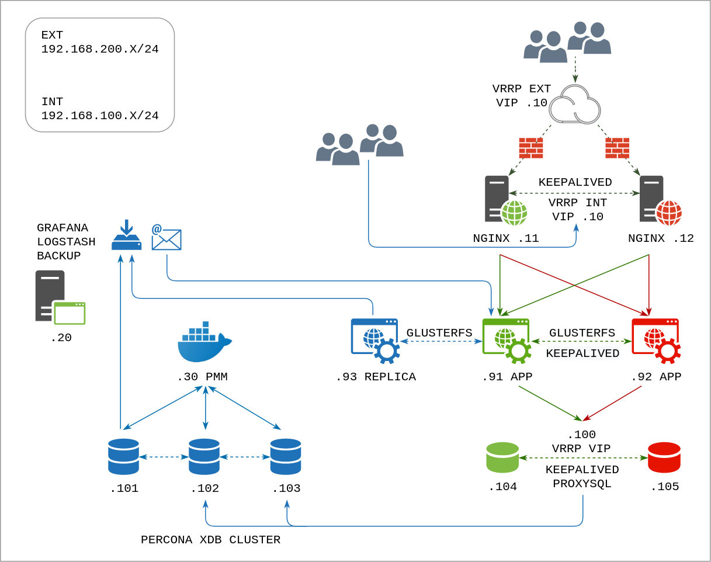
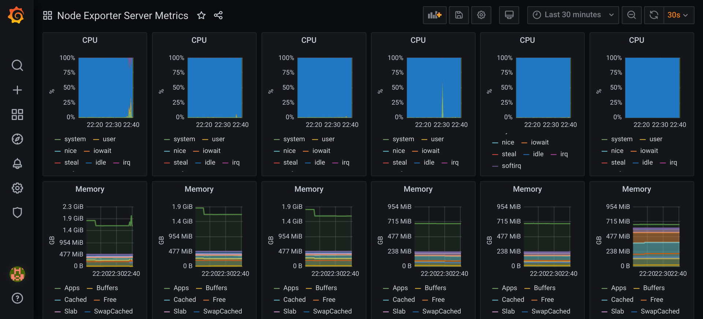
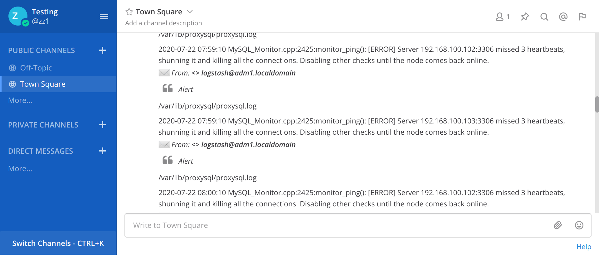
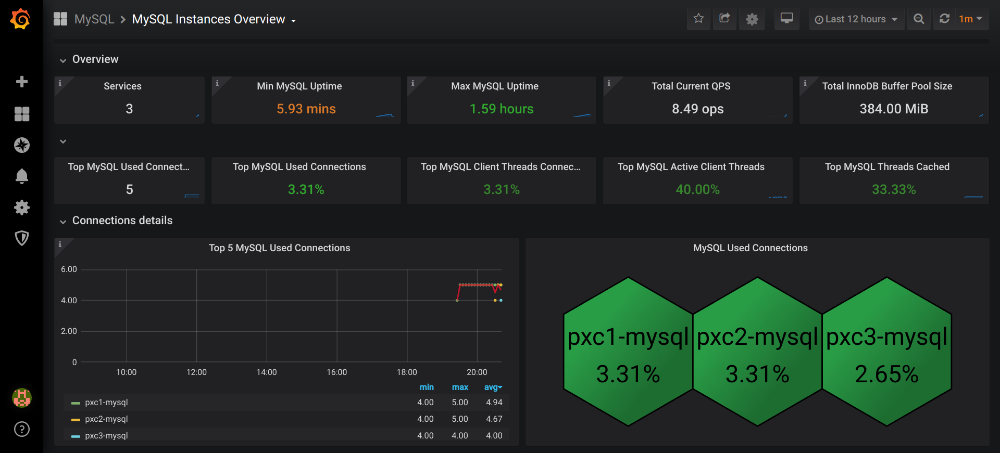

### Выпускной проект курса «Администратор Linux»

Цель — построить высокодоступный отказоустойчивый НА-кластер (High-Availability cluster) и настроить его функционирование.

За основу взят проект Mattermost - платформа для обмена сообщениями с открытым исходным кодом.

В проект включены:
- 3 узла с СУБД Percona XtraDB Cluster
- 2 узла ProxySQL;
- 2 узла с веб-серверами Nginx;
- 2 узла с приложением и узел для реплики;
- сервер мониторинга Grafana;
- сервер мониторинга СУБД Percona Monitoring and Management;
- центральный сервер сбора логов Logstash;  
- настройка межсетевого экрана (запрещено всё, что не разрешено);
- резервное копирование Borg Backup;
- резервное копирование Percona XtraBackup;
- использованы технологии VRRP, GlusterFS.



###### pxc1 pxc2 pxc3
3 узла с СУБД Percona XtraDB Cluster образуют кластер master-master с синхронной репликацией, в котором два узла используются одновременно для чтения и записи, третий узел - для реплики и бэкапа. Бэкап запускается по расписанию, в скрипте через xtrabackup создается локальный бэкап, упаковывается в архив и отправляется на сервер adm1.
```
mysql> show status like 'wsrep%';
...
| wsrep_local_state_comment        | Synced    
| wsrep_incoming_addresses         | 192.168.100.101:3306,192.168.100.102:3306,192.168.100.103:3306         
| wsrep_cluster_size               | 3        
| wsrep_provider_capabilities      | :MULTI_MASTER:CERTIFICATION:PARALLEL_APPLYING:TRX_REPLAY:ISOLATION:PAUSE:CAUSAL_READS:INCREMENTAL_WRITESET:UNORDERED:PREORDERED:STREAMING:NBO:  
...
```
###### sqlp1 sqlp2
2 узла ProxySQL выступают посредником между приложением и БД через свой виртуальный адрес, который назначается демоном keepalived одному из серверов в зависимости от состояния сети и наличия рабочего процесса proxysql. Один узел рабочий, второй запасной. ProxySQL формирует пул из серверов БД и перенаправляет на него запросы со своего порта 6033 на порт 3306, периодически проверяя подключение к узлам БД. Для этого в ProxySQL и в кластере Percona создается общий пользователь. Если один из узлов БД не отвечает, то он исключается из пула. В случае успешной проверки узел БД возвращается в пул.
```
mysql -u admin -padmin -h 127.0.0.1 -P 6032
SELECT * FROM mysql_servers;
SELECT * FROM monitor.mysql_server_ping_log ORDER BY time_start_us DESC LIMIT 6;
SELECT * FROM monitor.mysql_server_connect_log ORDER BY time_start_us DESC LIMIT 16;
SELECT hostgroup, srv_host, srv_port, status FROM stats.stats_mysql_connection_pool;
```
```
mysql> SELECT hostgroup, srv_host, srv_port, status FROM stats.stats_mysql_connection_pool;
+-----------+-----------------+----------+---------+
| hostgroup | srv_host        | srv_port | status  |
+-----------+-----------------+----------+---------+
| 0         | 192.168.100.102 | 3306     | ONLINE  |
| 0         | 192.168.100.103 | 3306     | SHUNNED |
+-----------+-----------------+----------+---------+

mysql> SELECT hostgroup, srv_host, srv_port, status FROM stats.stats_mysql_connection_pool;
+-----------+-----------------+----------+--------+
| hostgroup | srv_host        | srv_port | status |
+-----------+-----------------+----------+--------+
| 0         | 192.168.100.102 | 3306     | ONLINE |
| 0         | 192.168.100.103 | 3306     | ONLINE |
+-----------+-----------------+----------+--------+
```

###### ngx1 ngx2
2 узла с веб-серверами Nginx в режиме реверс-прокси предоставляют на внешнем и внутреннем интерфейсах виртуальные адреса, которые назначаются демоном keepalived одному из серверов в зависимости от состояния сети и наличия рабочего процесса nginx. Внешние и внутренние клиенты обращаются на соответствующие адреса. Запросы перенаправляются на один из узлов приложения. Один узел рабочий, второй запасной.
```
http://192.168.100.10 - vrrp int
http://192.168.100.11
http://192.168.100.12
http://192.168.200.10 - vrrp ext
http://192.168.200.11
http://192.168.200.12
```
###### app1 app2 app3
2 узла Mattermost имеют общий раздел GlusterFS в режиме реплики на отдельном диске. Общий раздел нужен для синхронизации данных пользователей и файлов, которые пересылаются через приложение. Один узел рабочий, второй запасной. В случае отключения сети приложение аварийно завершает работу, поэтому демон keepalived отслеживает состояние интерфейсов и через notify-скрипт перемонтирует раздел GlusterFS и перезапускает приложение. Третий узел с репликой подключен для создания кворума и выполнения бэкапов через Borg Backup.
```
http://192.168.100.91:8065
http://192.168.100.92:8065

gluster peer status
gluster pool list
gluster volume status
gluster volume info
```
Стенд разворачивается без GlusterFS. Настройка GlusterFS делается отдельным плейбуком:
```
ansible-playbook --private-key=~/.vagrant.d/insecure_private_key -u vagrant -i .vagrant/provisioners/ansible/inventory/vagrant_ansible_inventory playbooks/mm-glusterfs.yml
```
###### adm1
Сервер мониторинга Grafana отображает данные системы Prometheus, которая получает метрики от агентов Node_exporter.
```
admin:admin
http://192.168.100.20:3000
http://192.168.100.20:9090/targets
```


На этом же сервере находится репозиторий с бэкапами Borg Backup:
```
/root/mm-files
borg mount /root/mm-files::{backup_name} /{target}
```
Бэкапы БД копируются в домашний каталог администратора.

Сервер сбора логов Logstash получает сообщения от агентов Filebeat, которые выборочно по ключевым словам отправляют логи со своих систем. Полученные логи сохраняются в /var/log/logstash в подкаталог с именем узла источника. Из полученных данных по другим ключевым словам делается выборка для отправки в почту администратору.
```
ls /var/log/logstash
cat /var/spool/mail/root
tail -f /var/spool/mail/root
```
```
# tree /var/log/logstash/ngx1
/var/log/logstash/ngx1
└── var
    └── log
        ├── audit
        │   └── audit.log
        ├── keepalived.log
        ├── messages
        └── nginx
            ├── access.log
            └── error.log
```
Протестирована интеграция Mattermost с почтой администратора через плагин Mail2Most и dovecot. В стенд она не включена.



Общий список лог-файлов для мониторинга:
```
/var/log/messages
/var/log/audit/audit.log
/var/log/nginx/access.log
/var/log/nginx/error.log
/var/log/keepalived.log
/var/log/mysqld.log
/var/lib/proxysql/proxysql.log
/opt/mattermost/logs/masttermost.log
/var/log/borg.log
/var/log/backup-mysql.log
```
###### adm2
Сервер мониторинга СУБД Percona Monitoring and Management отображает метрики от собственных агентов, установленных на узлах Percona XtraDB Cluster. Запускается в докер-контейнере от производителя.
```
admin:admin
http://192.168.100.30
https://192.168.100.30
```


###### Настройка стенда

В вагрант-файле задается каталог, в котором будут создаваться файлы дополнительных дисков. К имени каталога добавляется имя ВМ app{1,2,3} и имя файла app{1,2,3}sdb.vdi. Этот каталог должен существовать в системе, на которой разворачивается стенд:
```
vboxvms = ENV['HOME'] + '/VBox'
```
Общие переменные для ролей, пароли, адреса к файлам дистрибутивов для загрузки задаются в файле group_vars/all/vars.yml  
Для упрощения запуска MySQL установлен параметр safe_to_bootstrap: 1 в файле grastate.dat на сервере pxc1.  
Необходмость установки PMM отдельно задается переменной setup_pmm, т.к. эта ВМ использует большой объем памяти.  
Переменная site_url задает URL для сайта, имя должно разрешаться в ip-адрес, например, через локальный /etc/hosts:
```
$ cat /etc/hosts
192.168.200.10 mm.otus.local
192.168.100.10 mm.otus.int
```
###### Порядок запуска ВМ

ngx - adm1 - adm2 - pxc (для регистрации агентов нужен сервер PMM) - sqlp - app (нужен доступ к БД)

При перезапуске ВМ сбрасываются настройки зон фаервола. Для восстановления можно использовать скрипт fixes/run_fixes.sh
