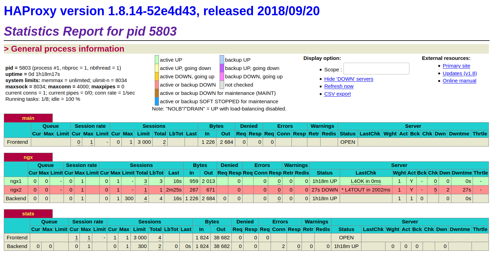
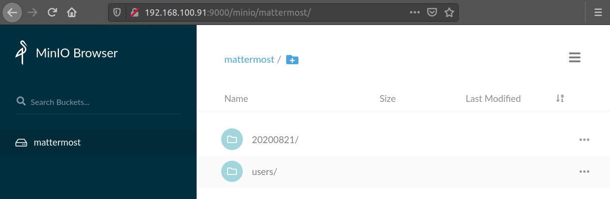

### Модификация стенда

https://github.com/pdpqbq/linux-adm/tree/master/99_mattermost

На ngx установлен HAProxy, который в режиме round robin перенаправляет запросы на один из ngx-ов с проверкой доступности.  

Доступ к сервису Mattermost:  
http://192.168.100.10:5000  

Доступ к статистике HAProxy:  
http://192.168.100.10:10001/haproxy_stats  
http://192.168.100.11:10001/haproxy_stats  
http://192.168.100.12:10001/haproxy_stats  
admin:admin



Общее хранилище на app вместо GlusterFS сделано на объектном хранилище MinIO в distributed режиме - 3 узла по 4 диска.  

http://192.168.100.91:9000  
http://192.168.100.92:9000  
http://192.168.100.93:9000  
minio:minio123



Ручной запуск:
```
export MINIO_ACCESS_KEY=minio
export MINIO_SECRET_KEY=minio123

cd /opt/minio
./minio server http://app{1...3}:9000/data/drive{1...4}
./minio server /data/drive{1...4}
```
Создание копии бакета для бэкапа:
```
cd /opt/minio
mkdir /tmp/minio
./mc mirror local/mattermost /tmp/minio
```
